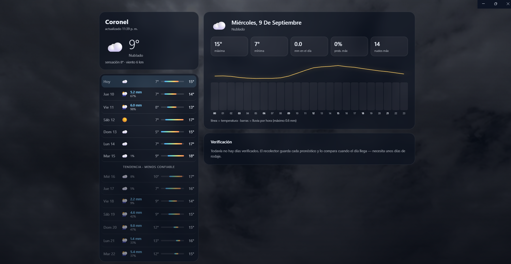
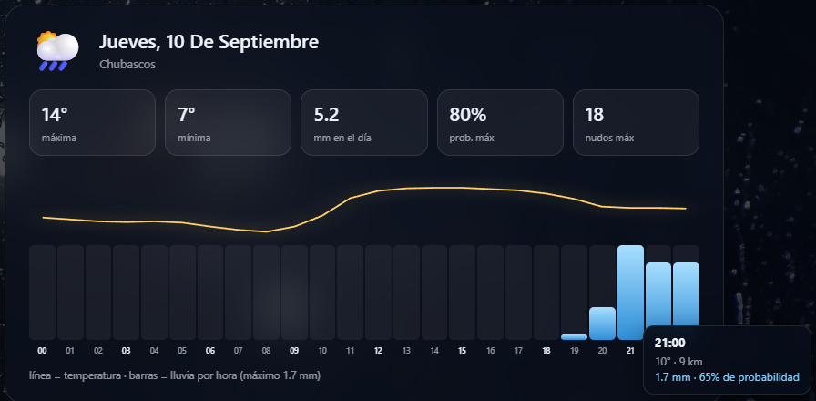
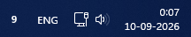
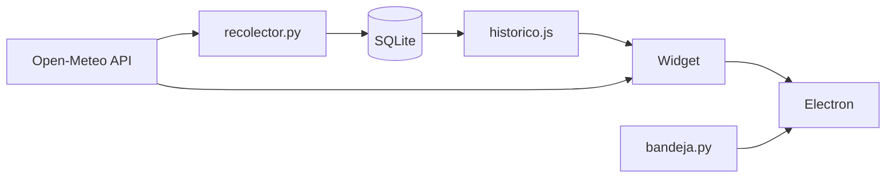

<div align="center">


# ClimApp

**Pronóstico meteorológico local que no solo predice: mide qué tan bien le achunta.**

Una app de escritorio para Coronel, Chile, que consulta varios modelos meteorológicos,
calcula la probabilidad real de lluvia a partir de un ensemble, y guarda cada pronóstico
para compararlo después con lo que realmente pasó.




</div>

---

## El problema

Las apps del clima te muestran un número y te piden que le creas.

Pero el mismo día puede tener pronósticos muy distintos según el modelo. Para un viernes
de septiembre en Coronel:

| Fuente | Lluvia pronosticada |
|---|---|
| ECMWF | 17.8 mm |
| iPhone | 9 mm |
| Ensemble GFS (mediana) | 3.3 mm |
| Windguru | ~2 mm |

Entre 2 y 18 mm hay un factor de nueve. **Ninguna de esas apps te dice cuál suele acertar
en tu zona**, ni te muestra que las otras piensan distinto.

ClimApp responde esa pregunta con datos propios: guarda todos los días lo que predijo
cada modelo, lo compara con lo observado cuando el día llega, y construye un historial
de exactitud específico para un punto geográfico.

---

## Qué hace

- **Pronóstico a 14 días** con temperatura, precipitación y viento
- **Probabilidad de lluvia calculada desde un ensemble** — el porcentaje de las 30+
  corridas del modelo que dan lluvia, en vez de un número entregado ya masticado
- **Detalle hora por hora** de cualquier día, con curva de temperatura y lluvia acumulada
- **Verificación histórica** — error promedio y tasa de acierto por modelo y por días
  de anticipación
- **Fondo en video** que cambia según la condición del día seleccionado
- **Ícono en la bandeja del sistema** con la temperatura actual

### Detalle hora por hora



Cada barra es la lluvia de esa hora y la línea amarilla la temperatura. Al pasar el
cursor salen los valores exactos: milímetros, probabilidad y viento.

### Siempre a la vista



La temperatura actual en la barra de tareas, y un clic abre la app completa.

---

## Cómo funciona



El sistema está partido en dos piezas deliberadamente.

**El recolector** (`recolector.py`) corre una vez al día mediante el Programador de
Tareas de Windows. Pide los pronósticos, los guarda en SQLite junto con su anticipación
—cuántos días antes se hizo la predicción—, trae lo observado de días pasados y exporta
el resumen de verificación.

**El widget** solo lee y muestra. Consulta la API en vivo para el pronóstico actual y
lee el histórico desde el archivo generado.

Esa separación importa: si el guardado viviera dentro de la app, cada día que no la
abrieras sería un día de datos perdido para siempre.

---

## El esquema de datos

La clave del proyecto está en guardar la **anticipación** de cada pronóstico:

```sql
CREATE TABLE pronostico (
    modelo         TEXT,
    fecha_captura  TEXT,     -- cuándo se hizo la predicción
    fecha_objetivo TEXT,     -- para qué día
    anticipacion   INTEGER,  -- días de diferencia
    precip_mm      REAL,
    prob_lluvia    REAL,
    temp_max       REAL,
    temp_min       REAL,
    viento_max     REAL,
    PRIMARY KEY (modelo, fecha_captura, fecha_objetivo)
);
```

Sin ese campo no se puede responder la pregunta importante: un modelo puede ser excelente
a 2 días y ruido a 8. La clave primaria compuesta hace que la operación sea idempotente
— el script puede correr varias veces el mismo día sin duplicar nada.

---

## Instalación

```bash
git clone https://github.com/lunaradev-sys/ClimApp.git
cd ClimApp

# Recolector y bandeja
pip install -r requirements.txt

# App de escritorio
cd escritorio
npm install
```

### Videos de fondo

No están incluidos en el repo. Bajá tres clips en MP4 H.264, horizontales, 1080p o 720p,
y guardalos en `widget/fondos/` con estos nombres:

| Archivo | Qué buscar |
|---|---|
| `sol.mp4` | blue sky sun time lapse |
| `nubes.mp4` | clouds time lapse |
| `lluvia.mp4` | rain city street / rain window |

Fuentes gratuitas: [Pexels Videos](https://www.pexels.com/videos/) ·
[Mixkit](https://mixkit.co/free-stock-video/) · [Coverr](https://coverr.co/)

### Cambiar la ubicación

Las coordenadas están al inicio de `recolector.py`, `bandeja.py` y `widget/app.js`:

```python
LAT, LON = -37.03, -73.16
```

---

## Uso

```bash
python recolector.py           # recolecta y guarda (programalo diariamente)
python bandeja.py              # ícono en la bandeja del sistema
cd escritorio && npm start     # app de escritorio
```

Para que el recolector corra solo: Programador de Tareas de Windows → tarea diaria
apuntando a `correr.bat`, con *"Ejecutar la tarea lo antes posible tras un inicio
programado omitido"* activado.

---

## Fuente de datos

[Open-Meteo](https://open-meteo.com/) — gratuita para uso no comercial y sin API key.

| Modelo | Origen | Alcance |
|---|---|---|
| `ecmwf_ifs025` | Centro Europeo | 15 días |
| `gfs025` | NOAA, Estados Unidos | 16 días |
| `ecmwf_aifs025` | Centro Europeo (IA) | 15 días |

La probabilidad de lluvia sale de la API de ensemble: se calcula qué porcentaje de los
miembros supera 1 mm en el día.

---

## Estado

Funcionando y recolectando. El histórico necesita entre uno y tres meses de datos para
que las métricas de verificación sean significativas.

**Próximos pasos**

- [ ] Corrección de sesgo local por modelo (post-proceso estadístico)
- [ ] Ponderar modelos según su desempeño histórico en el punto
- [ ] Gráfico de evolución del pronóstico para una fecha objetivo
- [ ] Alertas cuando la probabilidad de lluvia supere un umbral

---

## Licencia

MIT — ver [LICENSE](LICENSE).

<div align="center">
<br>


**[LunaraDV](https://github.com/lunaradev-sys)** · Coronel, Chile

</div>
